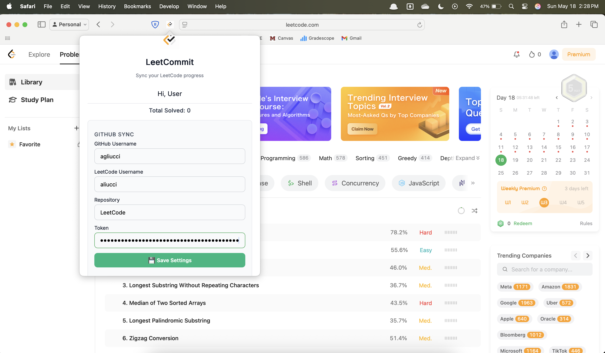

  

<h1 align="center">LeetCommit</h1>

  Effortlessly sync your <strong>LeetCode</strong> progress to <strong>GitHub</strong>.

  
  
  
  
  

---

## 🚀 Overview

**LeetCommit** is a lightweight Safari extension that automatically detects accepted LeetCode submissions and pushes them to a GitHub repository of your choice—complete with metadata like problem title, language, and difficulty. Showcase your problem-solving skills without ever copy-pasting again.

---

## 🧠 Features

- ✅ Auto-sync accepted LeetCode solutions
- 🧩 Metadata includes title, difficulty, and language
- 📁 Solutions organized by difficulty level in GitHub
- 🔐 Secure GitHub token storage (local only)
- ⚙️ Customizable repository and sync settings
- 📊 Tracks total synced problems and progress

---
<!-- 
## 📥 Installation

Available on the **Mac App Store**.  
👉 [Download LeetCommit for Safari](#) *(Insert your App Store link)*

Once installed:
1. Open **Safari > Settings > Extensions**
2. Enable **LeetCommit**
3. Configure your GitHub token, username, and repository in the extension settings

That’s it! Start solving problems on LeetCode and LeetCommit will take care of the syncing.

---
-->

## 🖼️ Preview

  

  

---

## 📨 Support

Have questions or feedback? Reach out via [email](mailto:agliucci9@gmail.com).

---

## 📄 License

MIT License. See `LICENSE` for more details.

---

## ✨ Acknowledgments

Built to automate what every LeetCode grinder does manually.  
Because time should be spent solving problems, not copying code.
